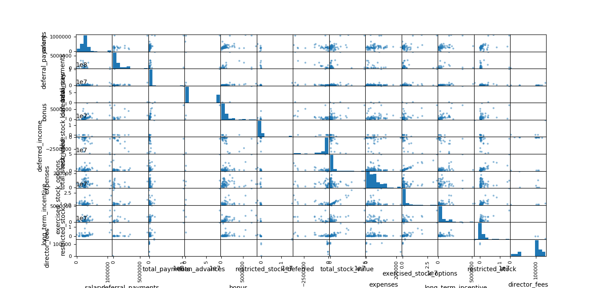
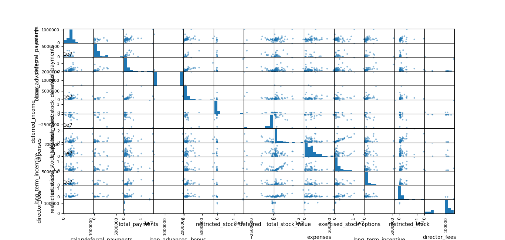
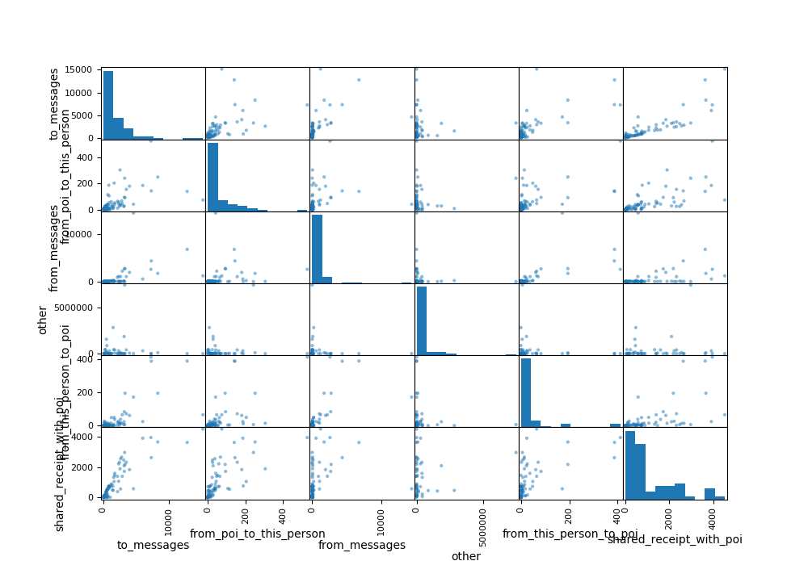

# Enron Submission Free-Response Questions

A critical part of machine learning is making sense of your analysis process and communicating it to others. The questions below will help us understand your decision-making process and allow us to give feedback on your project. Please answer each question; your answers should be about 1-2 paragraphs per question. If you find yourself writing much more than that, take a step back and see if you can simplify your response!

When your evaluator looks at your responses, he or she will use a specific list of rubric items to assess your answers. Here is the link to that rubric: [Link] Each question has one or more specific rubric items associated with it, so before you submit an answer, take a look at that part of the rubric. If your response does not meet expectations for all rubric points, you will be asked to revise and resubmit your project. Make sure that your responses are detailed enough that the evaluator will be able to understand the steps you took and your thought processes as you went through the data analysis.

Once you’ve submitted your responses, your coach will take a look and may ask a few more focused follow-up questions on one or more of your answers.  

We can’t wait to see what you’ve put together for this project!

## 1. project summary
Summarize for us the goal of this project and how machine learning is useful in trying to accomplish it. As part of your answer, give some background on the dataset and how it can be used to answer the project question. Were there any outliers in the data when you got it, and how did you handle those?  [relevant rubric items: “data exploration”, “outlier investigation”]

### 1.1 project goal
The goal is to identify potential persons of interest based on the information contained in a mailing and financial related dataset. Therefore, each person has an associated dictionary with financial and email related features as well as a "poi" label, which determines whether or not a person is of interest.

In order to determine if a new and unseen person is of interest or not, we are going to first train a classifier. The classifier should be able to learn from a labelled dataset how the features can be used to classify into Poi or not. The classifier does it by tuning a number of internal weights in the model to best fit the predictions with the true labels. In order to avoid overfitting to the training set, we will set aside a number of validation samples to verify that the algorithm is able to generalize its predictions to new unseen data.

The dataset is presented as a dictionary, where the keys are the names of the persons and its values are a dictionary with the following features:

 * Email related: to_messages, from_poi_to_this_person, from_messages, other, from_this_person_to_poi, shared_receipt_with_poi and email_address
 * Financial: salary,deferral_payments, total_payments, loan_advances, bonus, ,restricted_stock_deferred,deferred_income, total_stock_value ,expenses, exercised_stock_options,long_term_incentive, restricted_stock and director_fees
 * Label: Each person is also classified with the poi label (1 if true, 0 if false)

In total there are 145 people with 19 features, a name, an email and the POI label for each.

It should be noted that:
* Name and email will not be used for prediction as they are just some associated metadata. 
* There are only 18 POIs within 145 persons, being an unbalanced dataset.
* Some values are NaN values (see table below). Actually, for loan advances most of the values are NaN.
* Fortunately, all persons are classified as POIs or not. 
  
| column | number of NaNs |
| --- | ----------- |
|poi                          |0|
|to_messages                 |59|
|from_poi_to_this_person     |59|
|from_messages               |59|
|other                       |53|
|from_this_person_to_poi     |59|
|shared_receipt_with_poi     |59|
|salary                      |51|
|deferral_payments          |107|
|total_payments              |21|
|loan_advances              |142|
|bonus                       |64|
|restricted_stock_deferred  |128|
|deferred_income             |97|
|total_stock_value           |20|
|expenses                    |51|
|exercised_stock_options     |44|
|long_term_incentive         |80|
|restricted_stock            |36|
|director_fees              |129|

### 1.2 outliers
* Financial data: we use pandas scatter_matrix to plot all financial variables against each other in a scatter plot as well as a histogram per variable. We also list the top largest and smallest values of each variable.
	
    The first obvious outlier is TOTAL, which is removed. It likely comes from parsing an Excel table.
    We also see a group of outliers on most of the upper values of the variables. After a first glance, we see that many corresponds to POIs. It seems that most POIs have in common such high amounts and therefore they are not considered as outliers. As the number of POIs are low, I decided to put them aside from the data in order to avoid confusing them as outliers.
    
    We take a look to the remaining values. We see again some high values on salary, deferral payments, total payments and loan advances. As FREVERT MARK is involved in all of them, we consider that they are not outliers. So many mistakes in the same direction for the same person are unlikely. LAVORATO JOHN is also a similar case and we decide to keep it. 
    BHATNAGAR SANJAY also appears with abnormal values. The restricted_stock_deferred figure (15456k) is several orders of magnitude higher than the second one (44k). His restricted stock is also negative, being the only one. We consider both values as outliers and replace them by NaN.
    Finally, BELFER ROBERT is the only one with negative total stock value, negative deferral payments and positive restricted_stock_deferred. We consider these values as outliers and replace them by NaN.

* Email data: we use pandas scatter_matrix to plot all email variables against each other in a scatter plot as well as a histogram per variable. We also list the top largest and smallest values of each variable.
	
    We do not see any outliers as all values seems possible. 
    As a note, we see again Mr. FREVERT and Mr. LAVORATO in the top values, which indicates that something may be happening with them. 
    Finally, Mr BELFER and Mr.  BHATNAGAR do not appear in the top values, which indicates that they may be indeed outliers.

## 2. Features
What features did you end up using in your POI identifier, and what selection process did you use to pick them? Did you have to do any scaling? Why or why not? As part of the assignment, you should attempt to engineer your own feature that does not come ready-made in the dataset -- explain what feature you tried to make, and the rationale behind it. (You do not necessarily have to use it in the final analysis, only engineer and test it.) In your feature selection step, if you used an algorithm like a decision tree, please also give the feature importances of the features that you use, and if you used an automated feature selection function like SelectKBest, please report the feature scores and reasons for your choice of parameter values.  [relevant rubric items: “create new features”, “intelligently select features”, “properly scale features”]

### 2.1 Feature selection

In order to select the most relevant features, we are going to use the Kbest algorithm using the ANOVA F-value. In scikit learn this methos is called f-classif. We have chosen this method because it is the most suitable for clasification problems where features are quantitative. The F-value scores examine if, when we group the numerical feature by the target vector, the means for each group are significantly different (https://chrisalbon.com/machine_learning/feature_selection/anova_f-value_for_feature_selection/).

Under null hypothesis the F-value is expected to be 1. The higher the value, the more confident we are to reject it. Therefore we are going to keep the highest values. In order to assess if a F-value is high enough, we would need to  compute the F-distribution to calculate probabilities of discarding the null hypothesis. However, as we just want to select features, we are going to keep all features with values around 5 or higher:

| feature | F-value |
| --- | ----------- |
|'to_messages'| '1.69882434858085'|
|'from_poi_to_this_person'| '5.344941523147337'|
|'from_messages'| '0.16416449823428736'|
|'other'| '4.204970858301416'|
|'from_this_person_to_poi' |'2.426508127242878'|
|'shared_receipt_with_poi'|'8.74648553212908'|
|'salary' |'18.575703268041785'|
|'deferral_payments'| '0.23025211104949278'|
|'total_payments'| '8.866721537107772'|
|'loan_advances' |'7.242730396536018'|
|'bonus' |'21.06000170753657'|
|'restricted_stock_deferred'| '0.8603632406710227'|
|'deferred_income' |'11.5955476597306'|
|'total_stock_value' |'24.324449081480598'|
|'expenses'| '6.23420114050674'|
|'exercised_stock_options' |'25.09754152873549'|
|'long_term_incentive'| '10.072454529369441'|
|'restricted_stock' |'9.18877661833103'|
|'director_fees'| '2.107655943276091'|

The chosen features will be:

| feature | F-value |
| --- | ----------- |
|'from_poi_to_this_person'| '5.344941523147337'|
|'shared_receipt_with_poi'|'8.74648553212908'|
|'salary' |'18.575703268041785'|
|'total_payments'| '8.866721537107772'|
|'bonus' |'21.06000170753657'|
|'deferred_income' |'11.5955476597306'|
|'total_stock_value' |'24.324449081480598'|
|'expenses'| '6.23420114050674'|
|'exercised_stock_options' |'25.09754152873549'|
|'long_term_incentive'| '10.072454529369441'|
|'restricted_stock' |'9.18877661833103'|

We removed the loan advances due to the fact that although the F-value is high, it is not representative as most of the values are NaN.

### 2.2 New features

After taking a look to the financial features, it can be seen that they are correlated. For example, people with high salary values also appear in the top values of the rest of the financial values. Therefore, we are going to create a new feature that summarizes the financial features into a single one.

The new feature is defined as the average of the scaled available financial features for each person. Therefore, it will be between 0 and 1 and will be high for people with high financial values.

The idea behind is to replace multiple features with a single one that represents the underlaying fact that this person was making a lot of money,

After computing the F-value for, it happens that the value is 0.64 and therefore it will be discarded. Basically, the financial features separately work much better.  

### 2.3 Feature scaling
As we have seen in the previous section, the smallest and largest values are very different between variables. Therefore higher numbers will induce bigger changes in the algorithm. In order to give similar importance to the variables, we are going to scale them so they have similar importance. We could normalize them using the average and standard deviation, but we will use the max-min scaler as in the course. Finally, although not all algorithms are affected by feature scaling, we will do it anyway since we want to try with several algorithms and some of them need it (SVM).

## 3. Algorithm

### 3.1 Algorithms tested
What algorithm did you end up using? What other one(s) did you try? How did model performance differ between algorithms?  [relevant rubric item: “pick an algorithm”]

The followings algorithms were tested, using the recall can precision metrics for comparison. The metrics have been computed using the training set.

| Algorithm | precision | recall |
| --- | ----------- | ----------- |
|GaussianNB              |0.33 | 0.31|
|DecisionTreeClassifier  |1        |     1 |
|SVC-Linear              |0.75 | 0.23 |
|SVC-rbf                 |1 | 0.15 |

As can be seen, the values of the metrics are not representative of true performance of the algorithms, this is specially the case for the decision tree where both values are at 100% due to a clear overfitting. 

In order to account for the capacity of the algorithms to generalize when they face unseen samples, we will separate the data into 2 sets, one for training containing the 70% of the samples and the other for validation containing the remaining 30%. The samples are assigned randomly to each set.
Due to the fact that the assignations are at random, we will obtain different values each time we run it. To be more precise, we would need to average it over a number of different splits, for example using the k-fold algorithm, but for now we just want to have an idea of the performance. We will use later on stratifiedKfold to get the performance values of our chosen algorithm.

The precision and recall values are computed now using the validation set. 

| Algorithm | precision | recall |
| --- | ----------- | ----------- |
|GaussianNB              |0.5    |0.6 |
|DecisionTreeClassifier  |0.25    |  0.2 |
|SVC-Linear              |0.33    |0.2 |
|SVC-rbf                 |0    |0   |

We can see the how the true performance of the decision tree is much lower. Surprisingly, the performance of the GaussianNB is now better. Although it could be possible just by chance due to the split between training and validation sets, after using tester.py to double check this performance, it happens to be actually the case (although with lower values).

Our best algorithm is definitely GaussianNB.

### 3.2 Tune parameters
What does it mean to tune the parameters of an algorithm, and what can happen if you don’t do this well?  How did you tune the parameters of your particular algorithm? What parameters did you tune? (Some algorithms do not have parameters that you need to tune -- if this is the case for the one you picked, identify and briefly explain how you would have done it for the model that was not your final choice or a different model that does utilize parameter tuning, e.g. a decision tree classifier).  [relevant rubric items: “discuss parameter tuning”, “tune the algorithm”]

As the GaussianNB already complies with the 30% precision and recall requirements, we will choose the worst performant algorithm (SVC-rbf) to tune it and see if we can reach better levels of performance.

The first thing to notice is that the true positives are 0 since both recall and precision are 0. This is due to the fact that the labels in the dataset are unbalanced, that means, there are very few POIs (18), compared to the non POIs (127) and the algorithm has learn to classify everything as Non POI. 

Therefore we can:
* increase the "C" parameter, giving more weight to correctly predict the POIs.
* increase the "gamma" parameter, giving more weight to closest samples to the decision boundary and obtaining a more wiggly decision boundary.

In order to select the most suitable values of the parameters, we will use search grid function to iterate through all the values and obtain the ones with the greatest performance. The possible values for both gamma and C are from 0.001 to 1000 in a log 10 scale. 

Due to the fact that we have 2 metrics to find a maximum, I have built a new scoring function to measure performance as p = precision*recall. Using the accuracy metric would be misleading since an algorithm predicting all as non-POI would have great accuracy as the dataset is unbalanced (only 18 POIs). We could replace it by balanced_accuracy_score instead, but I wanted to be original and better target the requirements. 

Finally, the validation and training set will be determined using the stratified shuffle split cross validation function. This function shuffles and splits the data N folds to obtain the train and validation sets. It will be better explained later on.

After running GridSearchCV, the best parameters are: 'C': 100.0, 'gamma': 0.1 . The performance value is p=0.05 < 0.3*0.3 = 0.09, which implies that even if we tuned the parameters, we could not reach the 30% precision and recall. Therefore we will keep the GaussianNB algorithm

### 3.3 Validation
What is validation, and what’s a classic mistake you can make if you do it wrong? How did you validate your analysis?  [relevant rubric items: “discuss validation”, “validation strategy”]

Validation checks the algorithm performance against new unseen samples. By unseen I mean samples not used during training. It is important to validate since if the algorithm has enough parameters compared to the available training samples, it can "memorize" the results for the training set, obtaining great performance. However, when faced with unseen data, it will not be able to generalize the results an the prediction performance will be poor.

A classic mistake is to spit the training and validation distributions so they are not statistically similar. For example, if the elements belonging to one class are overepresented in the validation set or the probability distribution for certain features are different between training and validation sets, the results will be wrong. One way it can easily happen is if the data is sorted and we split the first samples for training and the last ones for validation. It is clear that the value that is used to sort the data will differ between both sets.

Another classic mistake for small number of samples is not averaging the validation results for example using k-fold. If the validation set is small we can have unlikely data distributions on it that give wrong performance values.

In order to correctly validate our algorithm, we:
  * Shuffle the samples in order to have them  similarly distributed between training and validation sets. Actually, stratifiedKfold preserves the percentage of samples for each class.
  * Divide the data into K bins, using each time one of them as the validation set and then average the performance results over them. This will avoid having validated by chance in a single and unlikely validation set obtained randomly. Note that if the sample set is small, which it is the case, this can occur.

The StratifiedKfold algorithms is also used in the test_classifier function in tester.py and in our algorithm.

## 4 Performance

### 4.1 Performance metrics
Give at least 2 evaluation metrics and your average performance for each of them.  Explain an interpretation of your metrics that says something human-understandable about your algorithm’s performance. [relevant rubric item: “usage of evaluation metrics”]

The performance metrics chosen are precision and recall. It is because they are the ones where we have the target of 30% and also because they make sense for the following reasons:
* Although Accuracy is widely used, in this case the labels are very unbalanced as there are very few POIs. This means that an algorithm predicting all labels as Non-POI would have high accuracy even if it is obviously a bad algorithm.
* Therefore we have to prioritize measuring true positives, since it is the most difficult tasks for the algorithm. Both precision and recall measure how well the true positives are predicted:
  * Recall: $\frac{t_p}{t_p+f_n}$ measures that no POI has been left undetected. If we only use recall we incentivize to have as much POIs predicted as possible
  * Precision: $\frac{t_p}{t_p+f_p}$ avoids that to many non POIs are considered positive by penalizing when false positives occur.

### 4.2 Performance results

Using GaussianNB(priors=None, var_smoothing=1e-09), these are the performance results obtained using the test_classifier function in tester.py:
        Accuracy: 0.84220
        Precision: 0.38749
        Recall: 0.31600
        F1: 0.34811
        F2: 0.32811
        Total predictions: 15000
        True positives:  632
        False positives:  999
        False negatives: 1368
        True negatives: 12001

Actually, my_classifier.pkl is a pipeline composed by:
* SimpleImputer(missing_values=np.nan, strategy='mean'): in order to replace the NaN values by the feature average, due to the fact that tester.py cannot handle NaN values.
* GaussianNB(): our classifier

The scaling has not been included in the pipeline because it is not needed.